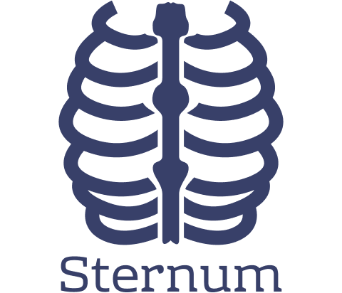

  

Sternum CDN
============================
Content delivery service for Sternum project. It allows uploading files and serving them through provided endpoints.

It is available as a docker image and that should be the primary way of using it.

Usage
-----
To upload file simply use `POST` and `form-data` with file under `resource` key to `/add` endpoint. Service automatically generates filename with UUIDv4. Extension is inherited from uploaded filename and files without extensions are prohibited. Response will contain service relative URL to file and generated filename e.g. `/static/test`.

To retrieve file `GET` on `/static/generatedfilename`. 

Service creates `$HOME/sternum-cdn/` directory for storing data.

Usage with Docker
-----------------
Image can be pulled from `mdud/sternum-cdn`. Example for starting service and mounting volume with docker-compose is provided in the `example` dir.

Development
-----------
Service is not dependent on other services therefore modifiying the source code should not cause much trouble. For convenience there is Vagrantfile provided for deploying development environment.